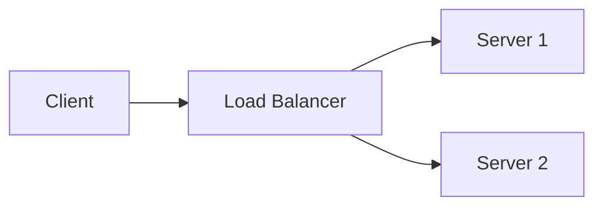

# Content Author Migration Guide

This guide explains how to structure content for documentation sites
built with the centralized docs-builder.

## How the Build Works

Your content repo contains **only** a `docs/` folder. At build time,
the reusable workflow copies your files into the builder's Astro project:

```
Your repo                          Builder repo (at build time)
docs/                    →         builder/src/content/docs/
  index.mdx              →           index.mdx
  guide/                 →           guide/
    01-overview.mdx      →             01-overview.mdx
```

Starlight expects content in `src/content/docs/`. The builder owns that
directory structure; your `docs/` folder maps directly into it.

## Content Folder Structure

```
your-repo/
├── docs/
│   ├── index.mdx              # Landing page (REQUIRED)
│   └── guide/                 # Guide pages (autogenerated sidebar)
│       ├── 01-overview.mdx
│       ├── 02-setup.mdx
│       └── 03-usage.mdx
├── .github/workflows/
│   └── deploy.yml             # Reusable workflow call (from template)
└── README.md
```

### Rules

- **`docs/index.mdx` is required.** It must contain a `title` in
  frontmatter. The builder extracts this as the site title.
- **Guide pages go in `docs/guide/`.** The sidebar auto-generates from
  this directory, sorted by filename prefix (`01-`, `02-`, etc.) or by
  the `sidebar.order` frontmatter field.
- **Use `.mdx` extension** for files that import components. Plain `.md`
  works for simple Markdown-only pages.
- **Do not create** `package.json`, `astro.config.mjs`, `tsconfig.json`,
  or any `src/` directory. The builder provides all of these.

## Frontmatter

### Landing page (`docs/index.mdx`)

```yaml
---
title: Your Site Title Here
description: A brief description of your documentation site.
template: splash
hero:
  tagline: Your tagline goes here.
  actions:
    - text: Get Started
      link: guide/01-overview/
      icon: right-arrow
      variant: primary
---
```

- **`title`** (required): Becomes the site-wide title in the header.
- **`template: splash`**: Uses the wide landing page layout.
- **`hero.actions[].link`**: Use **relative paths** (no leading `/`
  with your repo name). The builder sets the `base` path automatically.

### Guide pages (`docs/guide/*.mdx`)

```yaml
---
title: Page Title
description: Optional page description.
sidebar:
  order: 1
---
```

- **`title`** (required): Displayed as the page heading and sidebar link.
- **`sidebar.order`**: Controls sidebar sort order. Lower numbers appear
  first. If omitted, Starlight sorts alphabetically by filename slug.
- All [Starlight frontmatter fields](https://starlight.astro.build/reference/frontmatter/)
  are supported.

## Using Builder Components in MDX

The builder provides shared components that content authors can import.
**Import paths are relative to the file's final location inside the
builder**, not to your content repo.

After the build copies your file, a guide page at
`docs/guide/01-overview.mdx` ends up at
`builder/src/content/docs/guide/01-overview.mdx`. To reach the builder's
`src/components/` directory, you go up 3 levels:

```
src/content/docs/guide/01-overview.mdx
    ↑3     ↑2    ↑1
```

### Available Components

#### PlaceholderForm

Interactive form that lets readers customize placeholder values
throughout the guide.

```mdx
import PlaceholderForm from '../../../components/PlaceholderFormWrapper.astro';

<PlaceholderForm />
```

Use this at the top of any page that contains `xPLACEHOLDER_NAMEx`
tokens. The form replaces tokens with user-entered values.

### Import Path Reference

| Your file location | Import prefix to `src/components/` |
|---|---|
| `docs/guide/*.mdx` | `../../../components/` |
| `docs/index.mdx` | `../../components/` |
| `docs/guide/subdir/*.mdx` | `../../../../components/` |

The pattern: count directory levels from `src/content/docs/` to your
file, then go up that many levels plus one more to reach `src/`.

### Why paths look "wrong" locally

These relative imports resolve **at build time** inside the builder
project, not in your content repo. Your editor may show import errors
locally -- this is expected. The imports work correctly when the
workflow builds the site.

## Placeholder Tokens

To insert customizable values in your content, use the pattern
`xTOKEN_NAMEx` (lowercase `x` wrapping an UPPERCASE_NAME):

```mdx
The tunnel endpoint is xBIGIP_A_OUTER_V4x with mask xPROTECTED_MASK_V4x.
```

Available tokens are defined in the builder's
`src/data/placeholders.json`. The `PlaceholderForm` component provides
UI for readers to customize these values.

## Mermaid Diagrams

Use fenced code blocks with the `mermaid` language tag:

````mdx

````

Diagrams render client-side with white backgrounds. Placeholder tokens
inside diagrams are also substituted.

## Adding Subdirectories

You can organize content into subdirectories under `guide/`:

```
docs/
  guide/
    01-overview.mdx
    advanced/
      01-tuning.mdx
      02-monitoring.mdx
```

The sidebar will auto-generate nested groups. Subdirectory names become
group labels (use Starlight's `_meta.yml` or frontmatter to customize).

## What NOT to Include

Do not add any of these to your content repo:

- `node_modules/`, `package.json`, `package-lock.json`
- `astro.config.mjs`, `tsconfig.json`
- `src/` directory (components, styles, fonts, plugins, scripts)
- `.astro/`, `dist/`
- Docker files

These are all managed by the builder repo.

## Local Preview

Content authors cannot run `astro dev` locally (no framework files).
Two options for local preview:

### Option 1: Docker (recommended)

```bash
docker run --rm \
  -v $(pwd)/docs:/content/docs \
  -v $(pwd)/output:/output \
  ghcr.io/robinmordasiewicz/f5xc-docs-builder:latest
```

### Option 2: Manual builder checkout

```bash
git clone https://github.com/robinmordasiewicz/f5xc-docs-builder.git /tmp/builder
cd /tmp/builder
npm ci
rm -rf src/content/docs/*
cp -r /path/to/your-repo/docs/* src/content/docs/
DOCS_TITLE="Your Title" DOCS_BASE="/your-repo-name" npm run build
npm run preview
```

## Migrating from MkDocs

1. Keep your `docs/` folder as-is.
2. Rename `.md` files to `.mdx` if they need component imports.
   Plain `.md` files work for Markdown-only content.
3. Add frontmatter to each file (at minimum `title`).
4. Create `docs/index.mdx` with the landing page frontmatter (see above).
5. Delete `mkdocs.yml` and any Python/MkDocs-specific files.
6. Add `.github/workflows/deploy.yml` from the template.
7. Number your guide files with prefixes (`01-`, `02-`) or use
   `sidebar.order` frontmatter for ordering.

### MkDocs → Starlight Frontmatter Mapping

| MkDocs (`mkdocs.yml` nav) | Starlight (per-file frontmatter) |
|---|---|
| `nav:` section order | `sidebar.order` or filename prefix |
| Page title in `nav:` | `title` in frontmatter |
| `site_name` | `title` in `docs/index.mdx` |
| `site_description` | `description` in `docs/index.mdx` |

### Syntax Differences

| Feature | MkDocs | Starlight MDX |
|---|---|---|
| Admonitions | `!!! note "Title"` | `:::note[Title]` |
| Code blocks | `` ```python `` | `` ```python title="example.py" `` |
| Tabs | `=== "Tab 1"` | Use `<Tabs>` component (if available) |
| Images | `` | Same, or use `<Image>` component |
