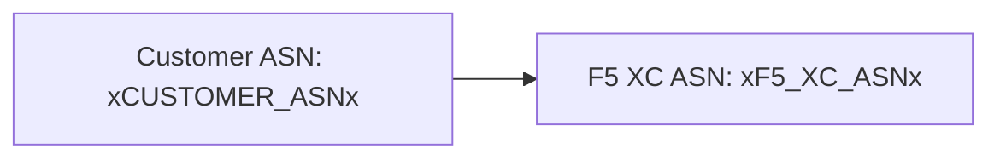

The builder supports [Mermaid](https://mermaid.js.org/) diagrams with two-phase processing: a remark plugin at build time prepares the markup, and a client-side renderer produces the SVG.

## Remark Plugin

The remark-mermaid plugin (provided by the `f5xc-docs-theme` npm package) runs during the Astro build. It uses `unist-util-visit` to find fenced code blocks with `lang === 'mermaid'` and replaces them with HTML:

```js
visit(tree, 'code', (node, index, parent) => {
  if (node.lang !== 'mermaid' || index === undefined || !parent) return;

  const escaped = node.value
    .replace(/&/g, '&amp;')
    .replace(/</g, '&lt;')
    .replace(/>/g, '&gt;')
    .replace(/"/g, '&quot;');

  parent.children[index] = {
    type: 'html',
    value: `<div class="mermaid-container" data-mermaid-src="${escaped}">
              <pre class="mermaid">${node.value}</pre>
            </div>`,
  };
});
```

Key details:

| Aspect | Value |
|--------|-------|
| Node type matched | `code` nodes where `lang === 'mermaid'` |
| HTML entity escaping | `&`, `<`, `>`, `"` — prevents attribute injection in `data-mermaid-src` |
| Output structure | `<div class="mermaid-container">` with `data-mermaid-src` attribute holding the escaped source |
| Fallback content | `<pre class="mermaid">` with the raw source (visible until JS renders) |

## Client-Side Rendering

The `renderMermaidDiagrams()` function in `src/scripts/placeholder-dom.ts` handles SVG generation in the browser.

### Mermaid Import

Mermaid is loaded on demand from a CDN — it is not bundled:

```ts
const mermaid = (await import('https://cdn.jsdelivr.net/npm/mermaid@11/dist/mermaid.esm.min.mjs')).default;
```

### Initialization

```ts
mermaid.initialize({
  startOnLoad: false,
  theme: 'default',
  securityLevel: 'loose',
  themeVariables: {
    primaryColor: '#ffffff',
    primaryBorderColor: '#cccccc',
    background: '#ffffff',
    mainBkg: '#ffffff',
    secondBkg: '#ffffff',
    tertiaryColor: '#ffffff',
  },
});
```

`startOnLoad: false` prevents Mermaid from auto-scanning the page. `securityLevel: 'loose'` allows click events and links in diagrams.

### Render Loop

For each `.mermaid-container` element:

1. Read the raw diagram source from `data-mermaid-src`
2. Run placeholder substitution on the source (see below)
3. Clear the container and remove any `data-processed` attribute
4. Call `mermaid.render()` with a random ID to produce SVG
5. Set `backgroundColor: 'white'` on the rendered `<svg>` element

## Placeholder Substitution in Diagrams

Before rendering, the diagram source passes through the same `substituteText()` function used by the DOM walker (see [Placeholder System](../02-placeholder-system/) for the walker mechanism):

```ts
const template = container.getAttribute('data-mermaid-src') || '';
const substituted = substituteText(template, values);
```

This means placeholder tokens like `xCUSTOMER_ASNx` work inside Mermaid diagram definitions. When a user changes a value in the form, the `placeholder-change` event triggers a full re-render of all diagrams with updated values.

## Error Handling

If `mermaid.render()` throws (for example, due to a syntax error in the diagram source), the catch block displays the error directly in the container:

```ts
} catch (e) {
  container.textContent = `Diagram error: ${e}`;
}
```

This makes authoring errors visible without breaking the rest of the page.

## Re-rendering

Diagrams re-render in two situations:

| Trigger | Event | What happens |
|---------|-------|-------------|
| Placeholder value changes | `placeholder-change` | `handleChange()` calls `renderMermaidDiagrams()` with new values |
| Astro page navigation | `astro:page-load` | `init()` calls `renderMermaidDiagrams()` for the new page |

## Authoring Syntax

Write a standard fenced code block with the `mermaid` language tag:

````markdown

````

The remark plugin converts this to a container div at build time. The client renders it as an SVG with placeholder values substituted.
